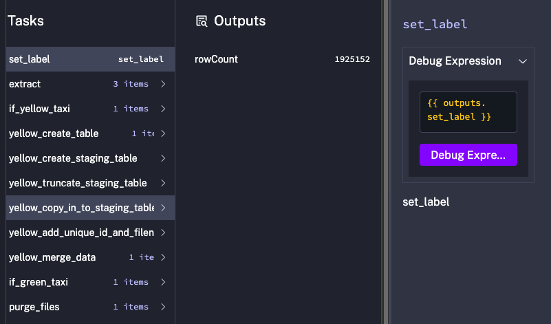

# orchestrator


## Running Docker Compose
```bash
(base) ➜  orchestrator git:(main) ✗ docker compose up -d

[+] Running 10/10
 ✔ kestra Pulled                                                                124.5s 
   ✔ 95b98843fe8e Pull complete                                                 122.2s 
   ✔ 34cde6ea6271 Pull complete                                                   9.9s 
   ✔ faa2dc15ff03 Pull complete                                                   0.6s 
   ✔ f3fc3ef6de67 Pull complete                                                   6.4s 
   ✔ 999485e2399b Pull complete                                                   0.8s 
   ✔ 47e1d55d5d40 Pull complete                                                   0.7s 
   ✔ 446dba5e20af Pull complete                                                   0.7s 
   ✔ 517f43312bfe Pull complete                                                   5.8s 
   ✔ a219d36f8115 Pull complete                                                   7.5s 
[+] Running 6/6
 ✔ Volume orchestrator_kestra_postgres_data  Created                                  0.0s 
 ✔ Volume orchestrator_kestra_data           Created                                  0.0s 
 ✔ Container orchestrator-kestra_postgres-1  Started                                  1.1s 
 ✔ Container orchestrator-kestra-1           Started                                  0.9s 
 ✔ Container orchestrator-pgdatabase-1       Sta...                                   0.3s 
 ✔ Container orchestrator-pgadmin-1          Starte...                                0.3s
 ```

## SQL QUERIES

```sql
SELECT COUNT(*) AS rows_2020
FROM public.green_tripdata
WHERE lpep_pickup_datetime >= '2020-01-01'
  AND lpep_pickup_datetime <  '2021-01-01';


SELECT COUNT(*) AS rows_2020
FROM public.yellow_tripdata
WHERE tpep_pickup_datetime >= '2020-01-01'
  AND tpep_pickup_datetime <  '2021-01-01';


SELECT *
FROM public.green_tripdata
WHERE lpep_pickup_datetime >= '2020-01-01'
  AND lpep_pickup_datetime <  '2021-01-01';

```

## KESTRA OUTPUTS


